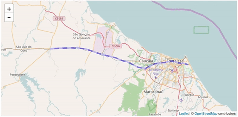

# Leaflet Ant Path
  
[](https://travis-ci.org/rubenspgcavalcante/leaflet-ant-path)
[](https://www.codacy.com/app/rubenspgcavalcante/leaflet-ant-path?utm_source=github.com&amp;utm_medium=referral&amp;utm_content=rubenspgcavalcante/leaflet-ant-path&amp;utm_campaign=Badge_Grade)
[](https://badge.fury.io/js/leaflet-ant-path)
[](https://badge.fury.io/bo/leaflet-ant-path)

## *Creates a leaflet polyline with a 'ant-path' animated flux*
[Live demo here](http://rubenspgcavalcante.github.io/leaflet-ant-path)  
[](http://rubenspgcavalcante.github.io/leaflet-ant-path)

## Contributing
Find any bug? Open a [issue](https://github.com/rubenspgcavalcante/leaflet-ant-path/issues) or make a PR!  
Also, see the guide on [how to contribute](/.github/contributing.md).

### Installing
Via NPM:
```
 npm install leaflet-ant-path
```

Via Bower:
```
 bower install leaflet-ant-path
```

Or just [download](https://github.com/rubenspgcavalcante/leaflet-ant-path-bower/archive/master.zip) this source code


### Requirements
  - Leaflet >= 1
    
### UMD compatible
Can be used with asynchronous module loaders and CommonJS packers
    
### Important!
- Leaflet AntPath uses CSS transitions to animate the SVG element. If the map options **preferCanvas** is active (true),
the animation will not work, as there's no information about what was drawn inside the canvas tag.

- MultiAntPath was removed, and now AntPath doesn't support the legacy version anymore (0.7.7). If you're still using
MultiAntPath and Leaflet 0.7, use older AntPath versions than 0.6
    
### Using the plugin
It's just like a polyline:  

```javascript
    // Using the constructor...
    let antPolyline = new L.Polyline.AntPath(latlngs, options);
    
    // ... or use the factory
    antPolyline = L.polyline.antPath(latlngs, options);
    
    antPolyline.addTo(map);
```


Using with ES6 imports
```javascript
    import { AntPath, antPath } from 'leaflet-ant-path';
    
    // Usethe constructor...
    let antPolyline = new AntPath(latlngs, options);
    
    // ... or use the factory
    antPolyline = antPath(latlngs, options);   
    
    antPolyline.addTo(map);
```

Using with AMD:  
```javascript
require(['leaflet-ant-path'], function(AntPathModule) {
    // Use the constructor ...
    let antPolyline = new AntPathModule.AntPath(latlngs, options);
    
    // ... or use the factory
    antPolyline = AntPathModule.antPath(latlngs, options);
    
    antPolyline.addTo(map);
});
```

Using with browserify:
```javascript
    const { AntPath, antPath } = require('leaflet-ant-path');
```

### Parameters
The AntPath extends from the [FeatureGroup](http://leafletjs.com/reference.html#featuregroup) and implements the [Path](http://leafletjs.com/reference.html#path) interface.
Initialise with the same options of a common [Polyline]((http://leafletjs.com/reference.html#polyline)), with some extra options, like the flux color.  

| name | type | example | description |
|------|------|---------| ------------|
|latlngs| L.LatLng[] **or** Array\[number, number\]  | \[ \[0, 10\], \[-20, 0\], ... \] | A array of latitude and longitudes (same as used in [Polyline constructor](http://leafletjs.com/reference.html#polyline) )
|options| Object  | {color: 'red', weight: 5, ...}  | Same as the [Polyline options](http://leafletjs.com/reference.html#polyline-options) plus the **extra** options bellow
|options.paused| boolean | true/false | Starts with the animation paused (default: false)
|options.reverse| boolean | true/false | Defines if the flow follows or not the path order
|options.pulseColor| string | #FF00FF | Adds a color to the dashed flux (default: 'white')
|options.delay | string | 120 | Add a delay to the animation flux (default: 400)
|options.dashArray| [number, number] **or** string | [15, 30] |The size of the animated dashes (default: "10, 20"). See also [the pattern](https://developer.mozilla.org/en-US/docs/Web/SVG/Attribute/stroke-dasharray)

---

### Methods
| name | returns | description |
|------|---------|-------------|
| pause() | boolean | Stops the animation |
| resume() | booelan | Resume the animation |
| reverse() | **this** instance | Reverses the animation flow |
| map(callback) | new AntPath or extended class | Iterates over the latlngs |

Also have the same as the L.Polyline API and with the same behaviour. [See it here.](http://leafletjs.com/reference.html#polyline)

---

# Extras!
### ES6/ES2015 features
Thinking in the new features of JavaScript, and its new way of programing,
AntPath has some nicely features to work with ES6.

#### spreadable
When spread the path, you will receive it lat/lngs array;
```javascript
    //...
    const antPathLayer = new AntPath(path, options);
    const anotherAntPath = new AntPath(path2, options);
    
    const latLngs = [...antPathLayer, ...anotherAntPath];
```

#### iterable
Use a **for ... of ...** to iterate over the path coordinates
```javascript
for(let latLng of antPath) {
    // do something with it latLngs ...
}
```

#### extensible
You can create you custom 'class' based on the AntPath:
```javascript
class CustomAntPath extends AntPath {
    //...
}
```

#### map method
AntPath has a map method as the Array, returning a new instance of AntPath
 *(or the child class which extends it, because of its Functor property)*:
```javascript
//New path with translated path
const newAnthPath = myAntPath.map(pos => latLng(pos.lat + 1, pos.lng + 1));
```

### With or without polyfills
The module provide two bundles, the full one, with some es6 polyfills (loaded by default when importing) and the lighter
one without the polyfills. If you're already uses the following polyfills in your project:
- regenerator-runtime
- core-js/es6/symbol
- core-js/es6/reflect

Just use the lighter version (leaflet-ant-path.es6.js). If not, just use the full bundle.

### License
This project is under the [MIT LICENSE](http://opensource.org/licenses/MIT)
